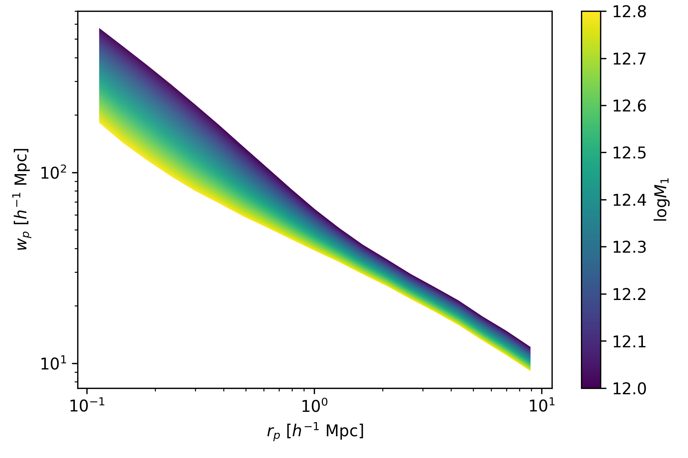
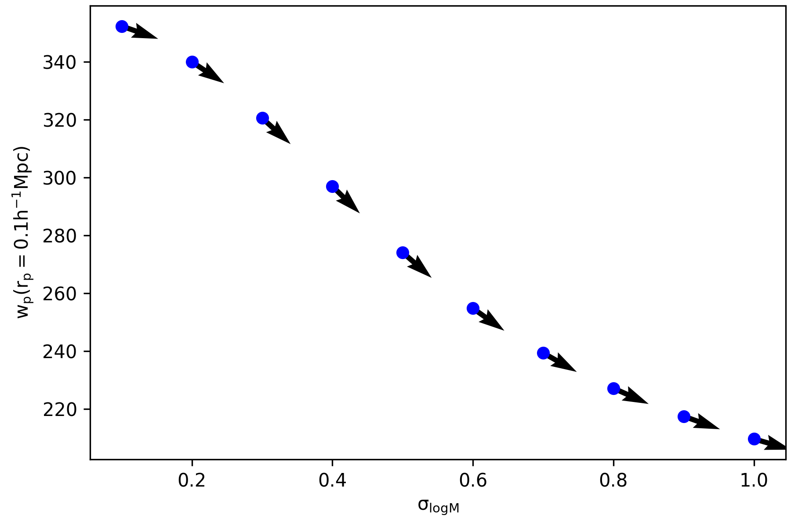

# JaxTabCorr - JAX + TabCorr

This is a partially rewritten version of the Python module TabCorr. It has been rewritten using JAX as a replacement for NumPy, which allows for easy differentiation, which is helpful for speeding up Bayesian inference compared to traditional MCMC methods. The API and following example script is nearly identical to that of TabCorr, allowing for minimal changes to preexisting code.

# TabCorr - Tabulated Correlation functions for halotools

This Python module provides extremely efficient and precise calculations of galaxy correlation functions in halotools using tabulated values. It is specifically intended for Markov chain monte carlo (MCMC) exploration of the galaxy-halo connection. It implements the method described in Zheng et al. (2016, http://adsabs.harvard.edu/abs/2016MNRAS.458.4015Z) of tabulating correlation functions that only need to be convolved with the mean halo occupation to obtain the full correlation function of galaxies.

---

### Prerequisites

The following python packages (and their prerequisites) are required for running this module.

* jax
* tabcorr
* halotools
* h5py
* numpy
* astropy

This module has been tested with Python 3.8.

---

### Installation

The package can be installed via pip from the main directory.

```
pip3 install --user .
```

---

### Usage

The following code demonstrates the basic usage of TabCorr. Scroll down to `# PART 2` to see the new functionality available using JAX.

```
import numpy as np
from matplotlib import cm
from matplotlib import colors
import matplotlib.pyplot as plt
from halotools.sim_manager import CachedHaloCatalog
from halotools.mock_observables import wp
from halotools.empirical_models import HodModelFactory, NFWPhaseSpace, TrivialPhaseSpace

import jax
from jaxtabcorr import JaxTabCorr, JaxZheng07Cens, JaxZheng07Sats

# First, we tabulate the correlation functions in the halo catalog. Note that
# by default, TabCorr applies redshift-space distortions (RSDs) in the
# tabulation of correlation functions.
rp_bins = np.logspace(-1, 1, 20)

halocat = CachedHaloCatalog(simname='bolplanck')
halotab = JaxTabCorr.tabulate(halocat, wp, rp_bins, pi_max=40,
                              period=halocat.Lbox)
# NOTE: this tabulation is not actually performed via Jax.
# This just calls TabCorr.tabulate (maybe Jax could speed it up though?)

# We can save the result for later use.
halotab.write('bolplanck.hdf5')

# We could read it in like this. Thus, we can skip the previous steps in the
# future.
halotab = JaxTabCorr.read('bolplanck.hdf5')

# Now, we're ready to calculate correlation functions for a specific model.
# NOTE: we have to build the HodModelFactory ourselves out of Jax-compatible models
threshold = -18
redshift = 0
model = HodModelFactory(
    centrals_occupation=JaxZheng07Cens(threshold=threshold, redshift=redshift),
    satellites_occupation=JaxZheng07Sats(threshold=threshold, redshift=redshift),
    centrals_profile=TrivialPhaseSpace(redshift=redshift),
    satellites_profile=NFWPhaseSpace(redshift=redshift)
)

rp_ave = 0.5 * (rp_bins[1:] + rp_bins[:-1])

ngal, wp = halotab.predict(model)
plt.plot(rp_ave, wp, label='total')

ngal, wp = halotab.predict(model, separate_gal_type=True)
for key in wp.keys():
    plt.plot(rp_ave, wp[key], label=key, ls='--')

plt.xscale('log')
plt.yscale('log')
plt.xlabel(r'$r_p \ [h^{-1} \ \mathrm{Mpc}]$')
plt.ylabel(r'$w_p \ [h^{-1} \ \mathrm{Mpc}]$')
plt.legend(loc='lower left', frameon=False)
plt.tight_layout(pad=0.3)
plt.gcf().set_facecolor("white")
plt.savefig('wp_decomposition.png', dpi=300); plt.show()
plt.close()

# Studying how the clustering predictions change as a function of galaxy-halo
# parameters is straightforward.

norm = colors.Normalize(vmin=12.0, vmax=12.8)
sm = cm.ScalarMappable(cmap=cm.viridis, norm=norm)
sm.set_array([])

for logm1 in np.linspace(12.0, 12.8, 1000):
    model.param_dict['logM1'] = logm1
    ngal, wp = halotab.predict(model)
    plt.plot(rp_ave, wp, color=sm.to_rgba(logm1), lw=0.1)

cb = plt.colorbar(sm)
cb.set_label(r'$\log M_1$')
plt.xscale('log')
plt.yscale('log')
plt.xlabel(r'$r_p \ [h^{-1} \ \mathrm{Mpc}]$')
plt.ylabel(r'$w_p \ [h^{-1} \ \mathrm{Mpc}]$')
plt.tight_layout(pad=0.3)
plt.gcf().set_facecolor("white")
plt.savefig('wp_vs_logm1.png', dpi=300); plt.show()
plt.close()


# PART 2: TAKING DERIVATIVES WITH JAX
# ===================================
# In order to calculate derivatives, we need to define a simple function
# that takes an array of parameters and returns an array of observables.
def wprp(x):
    param_names = ["logMmin", "sigma_logM", "logM0", "logM1", "alpha"]
    model.param_dict.update(dict(zip(param_names, x)))

    ngal, wp = halotab.predict(model)
    return wp

# Then, we can get a function to calculate the Jacobian, which 
# will return the matrix J[i, j] = dy[i]/dx[j]:
wprp_jacobian = jax.jacfwd(wprp)

# sigma_logm_truth = 0.25
for sigma_logm in np.linspace(0.1, 1.0, 10):
    # Explicitly hold all other parameters constant
    logmmin, logm0, logm1, alpha = 11.35, 11.2, 12.4, 0.83
    hod_params = np.array([logmmin, sigma_logm, logm0, logm1, alpha])
    
    # Get the value and derivative for the 0th rp bin of wp 
    # with respect to the 1st parameter, sigma_logM
    value = wprp(hod_params)[0]
    derivative = wprp_jacobian(hod_params)[0, 1]
    
    plt.plot(sigma_logm, value, "bo")
    plt.quiver(sigma_logm, value, 1, derivative, angles="xy")

plt.xlabel("$\\rm \\sigma_{\\log M}$")
plt.ylabel("$\\rm w_p(r_p = 0.1 h^{-1} Mpc)$")
plt.tight_layout(pad=0.3)
plt.gcf().set_facecolor("white")
plt.savefig("wp_derivative_vs_sigma_logm.png", dpi=300); plt.show()
plt.close()


# PART 3: THIS AlSO WORKS FOR GALAXY-GALAXY LENSING
# =================================================
# Get the position of a representative subsample of the simulation particles
particle_positions = np.array([halocat.ptcl_table[x] for x in "xyz"]).T
subsample = np.random.choice(np.arange(len(particle_positions)), int(1e5), replace=False)
particle_positions = particle_positions[subsample]

downsampling_factor = (halocat.num_ptcl_per_dim**3) / float(len(particle_positions))
effective_particle_masses = halocat.particle_mass * downsampling_factor

# Positional arguments passed to the mean_delta_sigma function
args = particle_positions, effective_particle_masses, rp_bins

lensingtab = JaxTabCorr.tabulate(
    halocat, mean_delta_sigma, *args, mode="cross",
    cosmology=bplcosmo)

for logm1 in np.linspace(12.0, 12.8, 1000):
    model.param_dict['logM1'] = logm1
    ngal, ds = lensingtab.predict(model)
    ds = ds / 1e12 / bplcosmo.h  # convert to conventional units
    plt.plot(rp_ave, ds, color=sm.to_rgba(logm1), lw=0.1)

cb = plt.colorbar(sm)
cb.set_label(r'$\log M_1$')
plt.xscale('log')
plt.yscale('log')
plt.xlabel(r'$r_p \ [h^{-1} \ \mathrm{Mpc}]$')
plt.ylabel(r'$\Delta \Sigma \ [h \  M_\odot/\mathrm{pc}^2]$')
plt.tight_layout(pad=0.3)
plt.gcf().set_facecolor("white")
plt.savefig('gglens_vs_logm1.png', dpi=300); plt.show()
plt.close()
```

The above code will generate the following figures.






---

### To-do list

* Currently, the only halotools model that has been implemented in a JAX-compatible
  way is the Zheng07 HOD model. It is very easy to implement these models, so 
  feel free to contact me requesting implementation of another halotools model.

---

### Authors

- Alan Pearl
- Johannes Ulf Lange (author of TabCorr)
